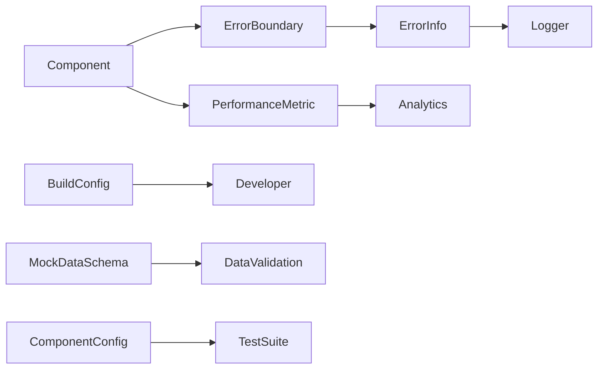

# Data Model: Application Refactor

**Date**: 2025-01-19
**Feature**: Application Refactor (017-refactor-app)

## Entity Definitions

### 1. ErrorInfo
Represents captured error information for logging and display.

```typescript
interface ErrorInfo {
  id: string;                    // Unique error ID
  timestamp: Date;                // When error occurred
  message: string;                // Error message
  stack?: string;                 // Stack trace
  componentStack?: string;        // React component stack
  context: ErrorContext;          // Additional context
  severity: 'low' | 'medium' | 'high' | 'critical';
  handled: boolean;               // Was error handled gracefully
}

interface ErrorContext {
  userId?: string;                // Current user if applicable
  route: string;                  // Current route/page
  action?: string;                // User action that triggered error
  metadata?: Record<string, any>; // Additional data
}
```

### 2. PerformanceMetric
Tracks performance measurements throughout the application.

```typescript
interface PerformanceMetric {
  id: string;                     // Unique metric ID
  name: string;                    // Metric name (LCP, FID, etc.)
  value: number;                   // Measured value
  unit: 'ms' | 'fps' | 'bytes' | 'percent';
  timestamp: Date;                 // When measured
  context: MetricContext;          // Additional context
  threshold?: number;              // Performance budget threshold
  passed: boolean;                 // Met performance criteria
}

interface MetricContext {
  page: string;                    // Page where measured
  component?: string;              // Specific component
  interaction?: string;            // User interaction type
  deviceType: 'mobile' | 'tablet' | 'desktop';
  connectionType?: string;        // Network connection type
}
```

### 3. BuildConfig
Configuration for build system optimization.

```typescript
interface BuildConfig {
  cacheDirectory: string;          // Custom cache location
  distDirectory: string;           // Build output directory
  syncServiceDetected: boolean;    // OneDrive/Dropbox detected
  optimizations: BuildOptimizations;
  environment: 'development' | 'production' | 'test';
}

interface BuildOptimizations {
  minify: boolean;                 // Code minification
  treeshake: boolean;              // Remove unused code
  splitChunks: boolean;            // Code splitting
  lazyLoad: boolean;               // Lazy loading enabled
  imageOptimization: boolean;      // Next/image optimization
}
```

### 4. ComponentConfig
Standardized component configuration.

```typescript
interface ComponentConfig {
  name: string;                    // Component name
  type: 'atom' | 'molecule' | 'organism' | 'template' | 'page';
  hasErrorBoundary: boolean;       // Error boundary implemented
  isLazyLoaded: boolean;           // Lazy loading enabled
  isMemoized: boolean;             // React.memo applied
  testCoverage?: number;           // Test coverage percentage
  performanceBudget?: {
    renderTime: number;            // Max render time in ms
    rerenderCount: number;         // Max rerenders per interaction
  };
}
```

### 5. MockDataSchema
Validation schema for mock data files.

```typescript
interface MockDataSchema {
  version: string;                 // Schema version
  dataType: 'video' | 'comment' | 'user' | 'analytics';
  required: string[];              // Required fields
  optional: string[];              // Optional fields
  validation: ValidationRules;     // Validation rules
}

interface ValidationRules {
  fields: Record<string, FieldValidation>;
  relationships?: RelationshipRule[];
}

interface FieldValidation {
  type: 'string' | 'number' | 'boolean' | 'array' | 'object';
  minLength?: number;
  maxLength?: number;
  pattern?: string;               // Regex pattern
  enum?: any[];                   // Allowed values
}
```

### 6. DeveloperConfig
Developer experience configuration.

```typescript
interface DeveloperConfig {
  setupCompleted: boolean;         // Initial setup done
  environment: EnvironmentConfig;  // Environment settings
  tools: DeveloperTools;           // Dev tools configuration
  documentation: DocumentationLinks;
}

interface EnvironmentConfig {
  nodeVersion: string;             // Node.js version
  packageManager: 'npm' | 'yarn' | 'pnpm';
  hasGitHooks: boolean;            // Pre-commit hooks setup
  hasEnvFile: boolean;             // .env.local exists
}

interface DeveloperTools {
  linting: boolean;                // ESLint configured
  formatting: boolean;             // Prettier configured
  typeChecking: 'strict' | 'normal' | 'loose';
  testing: boolean;                // Jest configured
}
```

## State Transitions

### Error States
```
IDLE → ERROR_THROWN → ERROR_CAUGHT → ERROR_LOGGED → ERROR_DISPLAYED → RECOVERED
                  ↓
              APP_CRASHED (if uncaught)
```

### Build States
```
IDLE → DETECTING_SYNC → CONFIGURING → BUILDING → OPTIMIZING → COMPLETE
            ↓                              ↓
      FALLBACK_CONFIG              BUILD_FAILED → RETRY
```

### Performance States
```
MEASURING → PROCESSING → COMPARING → PASS/FAIL → REPORTING
                                         ↓
                                    OPTIMIZATION_NEEDED
```

## Relationships



## Validation Rules

### ErrorInfo Validation
- `id` must be unique UUID
- `timestamp` must be valid Date
- `message` required, non-empty string
- `severity` must be one of defined values
- `context.route` must match valid route pattern

### PerformanceMetric Validation
- `value` must be positive number
- `unit` must be one of defined values
- `passed` calculated from value vs threshold
- `timestamp` must be valid Date

### BuildConfig Validation
- `cacheDirectory` must be valid path
- `distDirectory` must be writable
- At least one optimization must be enabled

### ComponentConfig Validation
- `name` must be PascalCase
- `type` must be one of atomic design types
- `performanceBudget` values must be positive

### MockDataSchema Validation
- `version` must follow semver
- `required` fields must exist in data
- `validation` rules must be valid

## Data Flow

1. **Error Flow**:
   ```
   Component Error → Error Boundary → ErrorInfo → Logger → Analytics
                                   ↓
                              Fallback UI
   ```

2. **Performance Flow**:
   ```
   User Interaction → Performance Observer → Metric Collection → Analysis → Reporting
                                                              ↓
                                                        Optimization
   ```

3. **Build Flow**:
   ```
   Source Files → Build Config → Compiler → Optimizer → Output
                       ↓
                 Sync Detection → Alternative Paths
   ```

## Migration Strategy

### Phase 1: Add New Models
- Implement interfaces without breaking changes
- Add to new components first

### Phase 2: Retrofit Existing
- Gradually update existing components
- Maintain backward compatibility

### Phase 3: Enforce Standards
- Make interfaces required
- Add validation at build time

## Schema Versioning
- Current Version: 1.0.0
- Breaking changes increment major
- New fields increment minor
- Bug fixes increment patch

---
**Status**: Data model defined, ready for contract generation